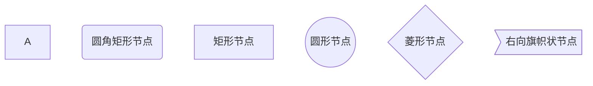
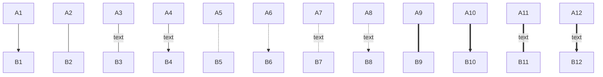
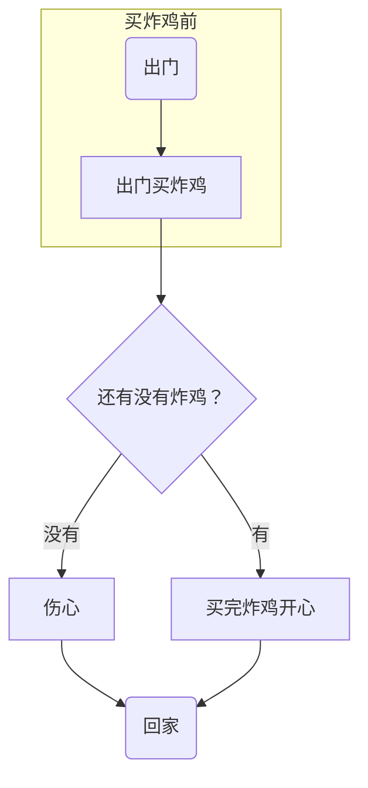
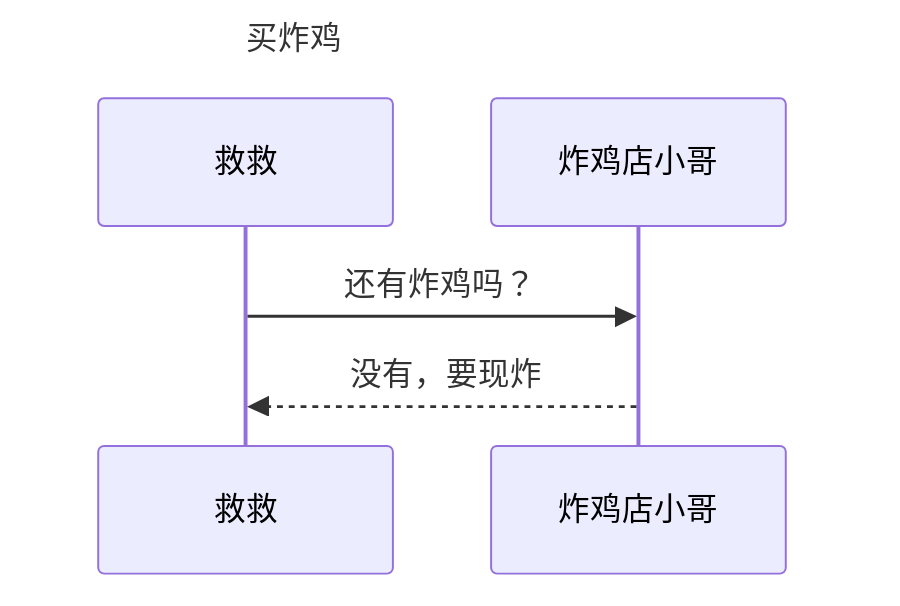
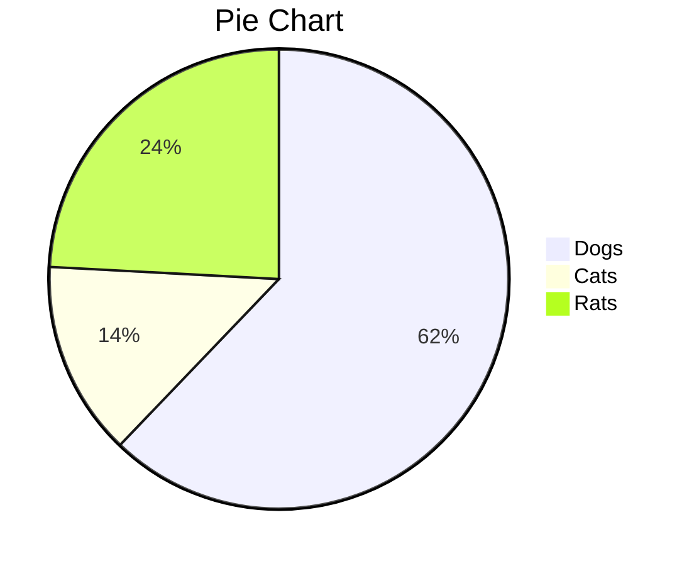
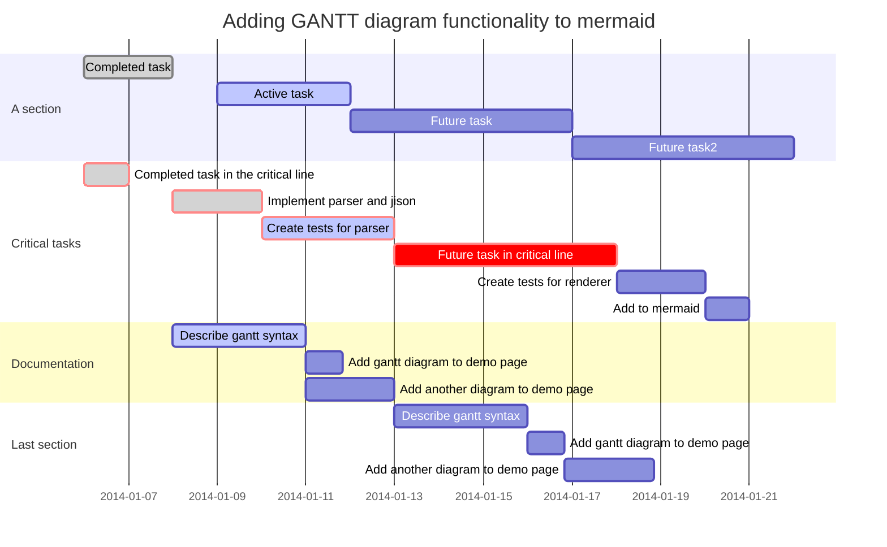

title: Markdown.4——流程图
date: 2022-04-04  19:40:11
categories: 

- 记录

tags: 

- markdown

---

主要用于记录markdown的流程图、关联图、序列图和饼图功能

<!--more--> 

# 流程图

## 格式

### 创建流图

````flow`

### 节点定义

`<名字>=>关键字: <文字描述>[:> url]`
需要注意的是:与文字描述中间的空格

### 节点关联

`名字1->名字2`

## 关键字

| 功能     | 关键字      | 示例                             | 说明                       |
| -------- | ----------- | -------------------------------- | -------------------------- |
| 开始     | start       | st=>start: 开始                  | NA                         |
| 结束     | end         | ed=>end: 结束                    | NA                         |
| 操作     | operation   | op=>operation: 获取用户输入      | NA                         |
| 条件     | condition   | isnull=>condition: 是否为空      | 接受后面跟yes/no从而走分支 |
| 输入输出 | inputoutput | sayok=>inputoutput: 数据存储成功 | NA                         |
| 子程序   | suboutline  | savedata=>subroutine: 存储数据   | NA                         |

## 示例

```
start=>start: 开始
end=>end: 结束
getdata=>operation: 接受数据:>http://www.baidu.com
isnull=>condition: 是否为空
sayerror=>inputoutput: 数据不能为空
sayok=>inputoutput: 数据存储成功
savedata=>subroutine: 存储数据

start->getdata->isnull(yes)->savedata->end
isnull(no)->sayerror->end
```

```flow
start=>start: 开始
end=>end: 结束
getdata=>operation: 接受数据:>http://www.baidu.com
isnull=>condition: 是否为空
sayerror=>inputoutput: 数据不能为空
sayok=>inputoutput: 数据存储成功
savedata=>subroutine: 存储数据

start->getdata->isnull(yes)->savedata->end
isnull(no)->sayerror->end
```

# 关联图

需要依赖Mermaid，参见[Markdown保姆级教程之画图篇（流程图、序列图、饼图、甘特图）_哔哩哔哩_bilibili](https://www.bilibili.com/video/BV1C7411V7SF/?spm_id_from=333.788.recommend_more_video.-1)

## 格式

### 创建流图

`···mermaid`

### 开头

`graph <方向关键字>;`

方向有如下几种

| 方向关键字 | 含义     |
| ---------- | -------- |
| TB         | 从上到下 |
| BT         | 从下到上 |
| LR         | 从左到右 |
| RL         | 从右到左 |

> **T = TOP, B = BOTTOM, L = LEFT, R = RIGHT**

### 节点定义

| 功能      | 方式       | 说明       |
| --------- | ---------- | ---------- |
| 开始/结束 | id(文字)   | 圆角矩阵   |
| 操作      | id[文字]   | 矩阵(默认) |
| 条件      | id{文字}   | 菱形       |
|           | id((文字)) | 圆形       |
|           | id>文字]   | 右向旗帜   |




### 节点关联

#### 线型

| 细实线  | 虚线    | 粗实线  |
| ------- | ------- | ------- |
| `A---B` | `A-.-B` | `A===B` |

#### 单向箭头

| 无箭头  | 右箭头  |
| ------- | ------- |
| `A---B` | `A-->B` |

#### 文字

| 无文字  | 有文字       |
| ------- | ------------ |
| `A---B` | `A--text--B` |

#### 长短

| 长              | 短      |
| --------------- | ------- |
| `A-----------B` | `A---B` |

#### 示例

```
graph TB
  A1-->B1
  A2---B2
  A3--text---B3
  A4--text-->B4
  A5-.-B5
  A6-.->B6
  A7-.text.-B7
  A8-.text.->B8
  A9===B9
  A10==>B10
  A11==text===B11
  A12==text==>B12
```



### 子图

```
subgraph 子图表名称
    子图表中的描述语句...
end
```

## 示例



# 序列图

## 概述

```markdown
sequenceDiagram 
	[参与者1][消息线][参与者2]:消息体
    ...
```

>`sequenceDiagram` 为每幅时序图的固定开头

```markdown
sequenceDiagram
		Title: 买炸鸡
    救救->>炸鸡店小哥: 还有炸鸡吗？
    炸鸡店小哥-->>救救: 没有，要现炸
```




## 参与者（participant）

传统时序图概念中参与者有角色和类对象之分，但这里我们不做此区分，用参与者表示一切参与交互的事物，可以是人、类对象、系统等形式。中间竖直的线段从上至下表示时间的流逝。

```markdown
sequenceDiagram
    participant 参与者 1
    participant 参与者 2
    ...
    participant 简称 as 参与者 3 #该语法可以在接下来的描述中使用简称来代替参与者 3
```

>`participant <参与者名称>` 声明参与者，语句次序即为参与者横向排列次序。

## 消息线

| 类型 | 描述                         |
| :--- | :--------------------------- |
| ->   | 无箭头的实线                 |
| -->  | 无箭头的虚线                 |
| ->>  | 有箭头的实线（主动发出消息） |
| –->> | 有箭头的虚线（响应）         |
| -x   | 末端为叉的实线（表示异步）   |
| --x  | 末端为叉的虚线（表示异步）   |

## 处理中-激活框

从消息接收方的时间线上标记一小段时间，表示对消息进行处理的时间间隔。

在消息线末尾增加 `+` ，则消息接收者进入当前消息的“处理中”状态；
在消息线末尾增加 `-` ，则消息接收者离开当前消息的“处理中”状态。

```markdown
sequenceDiagram
    participant 99 as 救救
    participant seller as 炸鸡店小哥
    99 ->> seller: 还有炸鸡吗？
    seller -->> 99: 没有，要现炸。
    99 -x +seller:给我炸！
    seller -->> -99: 您的炸鸡好了！
```

```mermaid
sequenceDiagram
    participant 99 as 救救
    participant seller as 炸鸡店小哥
    99 ->> seller: 还有炸鸡吗？
    seller -->> 99: 没有，要现炸。
    99 -x +seller:给我炸！
    seller -->> -99: 您的炸鸡好了！
    
```

## 注解（note）

语法如下

```markdown
Note 位置表述 参与者: 标注文字
```

其中位置表述可以为

| 表述     | 含义                       |
| :------- | :------------------------- |
| right of | 右侧                       |
| left of  | 左侧                       |
| over     | 在当中，可以横跨多个参与者 |

```markdown
sequenceDiagram
    participant 99 as 救救
    participant seller as 炸鸡店小哥
    Note over 99,seller : 热爱炸鸡
    Note left of 99 : 女
    Note right of seller : 男
    99 ->> seller: 还有炸鸡吗？
    seller -->> 99: 没有，要现炸。
    99 -x +seller : 给我炸！
    seller -->> -99: 您的炸鸡好了！
```

```mermaid
sequenceDiagram
    participant 99 as 救救
    participant seller as 炸鸡店小哥
    Note over 99,seller : 热爱炸鸡
    Note left of 99 : 女
    Note right of seller : 男
    99 ->> seller: 还有炸鸡吗？
    seller -->> 99: 没有，要现炸。
    99 -x +seller : 给我炸！
    seller -->> -99: 您的炸鸡好了！
```

## 循环（loop）

在条件满足时，重复发出消息序列。（相当于编程语言中的 while 语句。）

```markdown
sequenceDiagram
    participant 99 as 救救
    participant seller as 炸鸡店小哥
   
    99 ->> seller: 还有炸鸡吗？
    seller -->> 99: 没有，要现炸。
    99 ->> +seller:给我炸！
    loop 三分钟一次
        99 ->> seller : 我的炸鸡好了吗？
        seller -->> 99 : 正在炸
    end
    seller -->> -99: 您的炸鸡好了！
```

```mermaid
sequenceDiagram
    participant 99 as 救救
    participant seller as 炸鸡店小哥
   
    99 ->> seller: 还有炸鸡吗？
    seller -->> 99: 没有，要现炸。
    99 ->> +seller:给我炸！
    loop 三分钟一次
        99 ->> seller : 我的炸鸡好了吗？
        seller -->> 99 : 正在炸
    end
    seller -->> -99: 您的炸鸡好了！
```

## 选择（alt）

在多个条件中作出判断，每个条件将对应不同的消息序列。（相当于 if 及 else if 语句。）

```markdown
sequenceDiagram    
    participant 99 as 救救
    participant seller as 炸鸡店小哥
    99 ->> seller : 现在就多少只炸好的炸鸡？
    seller -->> 99 : 可卖的炸鸡数
    
    alt 可卖的炸鸡数 > 3
        99 ->> seller : 买三只！
    else 1 < 可卖的炸鸡数 < 3
        99 ->> seller : 有多少买多少
    else 可卖的炸鸡数 < 1
        99 ->> seller : 那我明天再来
    end

    seller -->> 99 : 欢迎下次光临
```

```mermaid
sequenceDiagram    
    participant 99 as 救救
    participant seller as 炸鸡店小哥
    99 ->> seller : 现在就多少只炸好的炸鸡？
    seller -->> 99 : 可卖的炸鸡数
    
    alt 可卖的炸鸡数 > 3
        99 ->> seller : 买三只！
    else 1 < 可卖的炸鸡数 < 3
        99 ->> seller : 有多少买多少
    else 可卖的炸鸡数 < 1
        99 ->> seller : 那我明天再来
    end

    seller -->> 99 : 欢迎下次光临
```

## 可选（opt）

在某条件满足时执行消息序列，否则不执行。相当于单个分支的 if 语句。

```markdown
sequenceDiagram
    participant 99 as 救救
    participant seller as 炸鸡店小哥
    99 ->> seller : 买炸鸡
    opt 全都卖完了
        seller -->> 99 : 下次再来
    end
```

```mermaid
sequenceDiagram
    participant 99 as 救救
    participant seller as 炸鸡店小哥
    99 ->> seller : 买炸鸡
    opt 全都卖完了
        seller -->> 99 : 下次再来
    end
```

## 并行（Par）

将消息序列分成多个片段，这些片段并行执行。

```markdown
sequenceDiagram
   participant 99 as 救救
   participant seller as 炸鸡店小哥
   
    99 ->> seller : 一个炸鸡，一杯可乐！

    par 并行执行
        seller ->> seller : 装可乐
    and
        seller ->> seller : 炸炸鸡
    end

    seller -->> 99 : 您的炸鸡好了！
```

```mermaid
sequenceDiagram
   participant 99 as 救救
   participant seller as 炸鸡店小哥
   
    99 ->> seller : 一个炸鸡，一杯可乐！

    par 并行执行
        seller ->> seller : 装可乐
    and
        seller ->> seller : 炸炸鸡
    end

    seller -->> 99 : 您的炸鸡好了！
```


# 饼图

```
pie
    title Pie Chart
    "Dogs" : 386
    "Cats" : 85
    "Rats" : 150 
```



# 甘特图

## 格式

```
  title 标题
	dateFormat 日期格式
	section 部分名
	任务名:参数一, 参数二, 参数三, 参数四，参数五
 
  //参数一：crit（是否重要，红框框） 或者 不填
  //参数二：done（已完成）、active（正在进行） 或者 不填(表示为待完成状态)
  //参数三：取小名 或者 不填
  //参数四：任务开始时间
  //参数五：任务结束时间
```

## 示例

```
gantt
       dateFormat  YYYY-MM-DD
       title Adding GANTT diagram functionality to mermaid

       section A section
       Completed task            :done,    des1, 2014-01-06,2014-01-08
       Active task               :active,  des2, 2014-01-09, 3d
       Future task               :         des3, after des2, 5d
       Future task2              :         des4, after des3, 5d

       section Critical tasks
       Completed task in the critical line :crit, done, 2014-01-06,24h
       Implement parser and jison          :crit, done, after des1, 2d
       Create tests for parser             :crit, active, 3d
       Future task in critical line        :crit, 5d
       Create tests for renderer           :2d
       Add to mermaid                      :1d

       section Documentation
       Describe gantt syntax               :active, a1, after des1, 3d
       Add gantt diagram to demo page      :after a1  , 20h
       Add another diagram to demo page    :doc1, after a1  , 48h

       section Last section
       Describe gantt syntax               :after doc1, 3d
       Add gantt diagram to demo page      :20h
       Add another diagram to demo page    :48h
```



